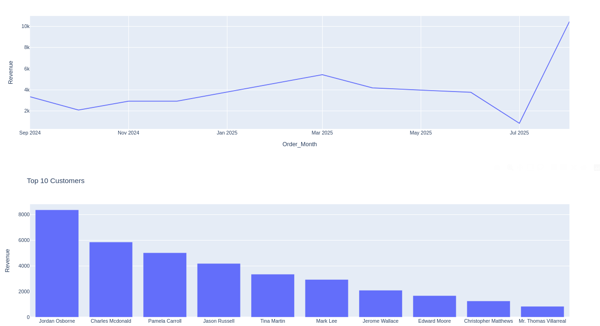

# PyBusinessAnalytics


**Interactive Python Dash dashboard for retail sales, revenue, and customer analytics using Excel data.**

---



---

## Project Overview

RetailDash is a professional-style dashboard built using **Python, Dash, Plotly, and Pandas**. It reads sales and inventory data from an **Excel workbook** and generates interactive charts for:

- Revenue by Product Category  
- Monthly Revenue Trends  
- Top Customers by Revenue  
- (Optional) Inventory Stock Levels  

The dashboard supports **category filtering** and can be extended for **real-time data updates**.

---

## Features

- ✅ Interactive visualizations using **Plotly and Dash**  
- ✅ Clean data handling with **Pandas**  
- ✅ Multi-sheet Excel support (Customers, Products, Orders, Inventory)  
- ✅ Dropdown filters for dynamic chart updates  
- ✅ Modular code structure for scalability  

---

## Project Structure


---

## Installation

1. Clone the repository:

```bash
git clone https://github.com/YOUR_USERNAME/PyBusinessAnalytics.git
cd PyBusinessAnalytics
python -m venv venv


pip install -r requirements.txt
Customizing the Excel File

The dashboard reads Dummy_Retail_Data.xlsx by default.

Ensure the workbook has sheets named:

Customers

Products

Orders

Inventory

---


Update data in these sheets and restart the app (or implement periodic reloads) to see changes.

Future Improvements

Real-time database integration (PostgreSQL, MySQL)

Cash flow and ROI KPIs

Inventory alerts and notifications

Export charts to Excel/PDF for reports

License

MIT License – free to use, modify, and distribute


---

✅ **Instructions for GitHub image to work:**
1. Place `dash.png` in the **same folder as README.md**  
2. Commit and push both README.md and dash.png  

```bash
git add README.md dash.png
git commit -m "Add README and dashboard screenshot"
git push


